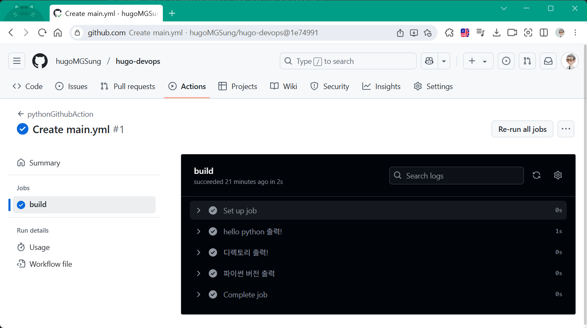
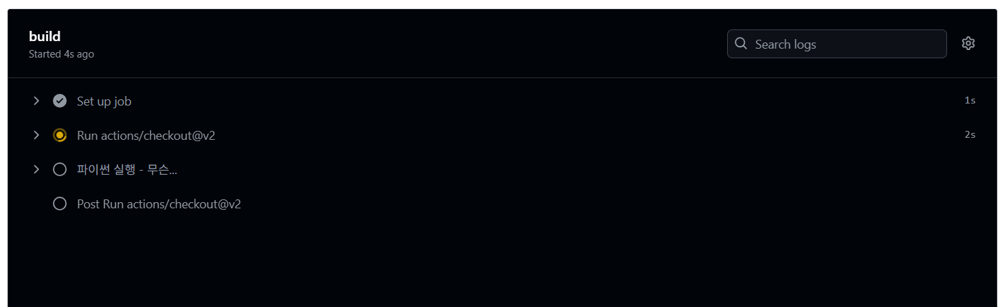

# hugo-devops
데브옵스 뭉태기

## CI/CD
- Continuous Integration
    - 개발자들이 작업한 코드를 자주(=하루에도 여러 번) 통합하고, 통합할 때마다 자동으로 빌드하고 테스트하는 프로세스
- Continuous Delivery
    - 코드를 언제든지 바로 배포할 수 있는 상태로 항상 유지하는 것

## 깃헙 액션 
1. Events - 어떤 일이 발생했는지를 지정
2. Workflows - 어떤 일을 수행하고 싶은지를 명시
3. Jobs - 워크플로우안에 포함되는 1개 또는 그 이상의 작업. Job안에 여러 순서를 Step으로 정의
4. Actions - 작 Job에서 사용할 수 있는 액션. 사용할 수 있는 다양한 명령
5. Runners - Job을 실행하는 것. VM, Container로 생각하면 됨

### yaml/yml 파일
- YAML Ain't Markup Language
- *.yaml 또는 *.yml 2개의 확장자를 사용
- 키의 값으로 매핑된 데이터를 주고 받는 양식으로 사용

### 만들기 개요
- .github/workflows/ 폴더 생성
- main.yaml 파일 생성

    ```yaml
    nam: learn-github-actions
    on: [push]
    jobs:
        check-bats-version:
            runs-on: ...
            steps:
                - uses: actions/checkout@v3
                ...
                - run: npm install -g bats
                ...
    ```

### 시작
1. 리포지토리 생성 후 set up a workflow yourself 클릭
2. main.yaml 파일 작성

    ```yaml
    name: pythonGithubAction

    on: [push]

    jobs:
    build:
        runs-on: ubuntu-latest
        steps:
        # run뒤에 실제 작동하는 코드 작성 필요
        - name: hello python 출력!
            run: echo Hello, Python!
        - name: 디렉토리 출력!
            run: ls -al
        - name: 파이썬 버전 출력
            run: python --version
    ```

3. Commit changes... 클릭

    


4. 수정
    ```yaml
    name: pythonGithubAction

    on: [push]

    jobs:
    build:
        runs-on: ubuntu-latest
        steps:
        # run뒤에 실제 작동하는 코드 작성 필요
        - uses: actions/checkout@v4
        - name: 파이썬 실행!
            run: python sample.py

    ```

5. 깃헙에 sample.py 푸시

    


### 기본크롤링 환경설정
- yaml 소스 전체

    ```yaml
    # github 액션명
    name: helloGithubAction

    # push 발생시 아래의 jobs 실행
    # [push, pull_request] 등과 같이 다중 이벤트 처리 가능
    on: [push]

    # 위 이벤트가 일어날 경우 실행될 job, 여러개 설정가능
    jobs:
        # 작업단위
        build:
            # 실행되는 OS : Windows, MacOS 적용
            runs-on: ubuntu-latest
            steps:
            # https://github.com/actions/checkout 폴더 참조
            - uses: actions/checkout@v4
            # OS에서 실행할 이름
            - name: 1. 파이썬 실행
            # OS에서 실행할 명령어
              run: python test.py
    ```